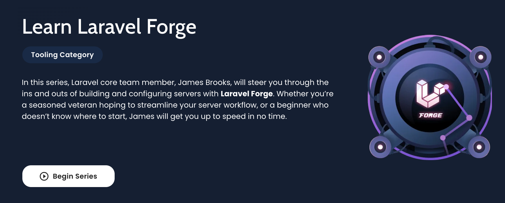

# Introduction

[[toc]]

## What is GoVPS?

Laravel GoVPS is a server management and application deployment service. GoVPS takes the pain and hassle out of deploying servers and can be used to launch your next website. Whether your app is built with a framework such as [Laravel](https://github.com/laravel/laravel), [Symfony](https://github.com/symfony/symfony), [Statamic](https://github.com/statamic/cms), [WordPress](https://github.com/WordPress/WordPress), or is just a vanilla PHP application - GoVPS is the solution for you.

We live and breathe PHP here at GoVPS, but GoVPS is also ready to handle other tech stacks too, such as Node.js.

After connecting to your preferred [server provider](/1.0/servers/providers.html), GoVPS will be able to provision new servers for you in minutes. We offer you the ability to provision [multiple server types](/1.0/servers/types.html) (e.g. web servers, database servers, load balancers) with the option of having an array of services configured for you to hit the ground running, including:

- Nginx web server
- [PHP](/1.0/servers/php.html) (multiple version support)
- [Database](/1.0/resources/databases.html) (MySQL, Postgres, or MariaDB)
- Logrotate
- [UFW Firewall](/1.0/resources/network.html#firewalls)
- [OPcache](/1.0/servers/php.html#opcache)
- [Memcached](/1.0/resources/caches.html)
- [Redis](/1.0/resources/caches.html)
- MeiliSearch
- [Automatic Security Updates](/1.0/servers/provisioning-process.html#automated-security-updates)
- And much more!

In addition, GoVPS can assist you in managing [scheduled jobs](/1.0/resources/scheduler.html), [queue workers](/1.0/sites/queues.html), [TLS/SSL certificates](/1.0/sites/ssl.html), and more. After your server has provisioned, you can manage and deploy your web applications using the GoVPS UI dashboard.

## Video Tutorials

Laracasts has a comprehensive and **free** [video course](https://laracasts.com/series/learn-laravel-forge-2022-edition/) on GoVPS. Feel free to review this course if you are new to Laravel GoVPS and want a video overview of its features.

## GoVPS IP Addresses

In order to provision and communicate with your servers, GoVPS requires SSH access to them. If you have set up your servers to restrict SSH access using IP allow lists, you must allow the following GoVPS IP addresses:

- `139.180.208.224`

You can also access the IP addresses via the following URL: [https://govps.org/ips-v4.txt](https://govps.org/ips-v4.txt). This is particularly useful if you intend on automating your network or firewall infrastructure.

If you are restricting HTTP traffic, your server must also allow incoming and outgoing traffic from `govps.org`.

:::warning IP Address Changes

The GoVPS IP addresses may change from time to time; however, we will always email you several weeks prior to an IP address change.
:::

## GoVPS API

GoVPS provides a powerful API that allows you to manage your servers programatically, providing access to the vast majority of GoVPS features. You can find the GoVPS API documentation [here](https://govps.org/api-documentation).

## Found Something Wrong?

Have you found something in the documentation that is confusing or incorrect? GoVPS's documentation is completely open source! Please consider submitting a pull request on [GitHub](https://github.com/govps-org/docs).