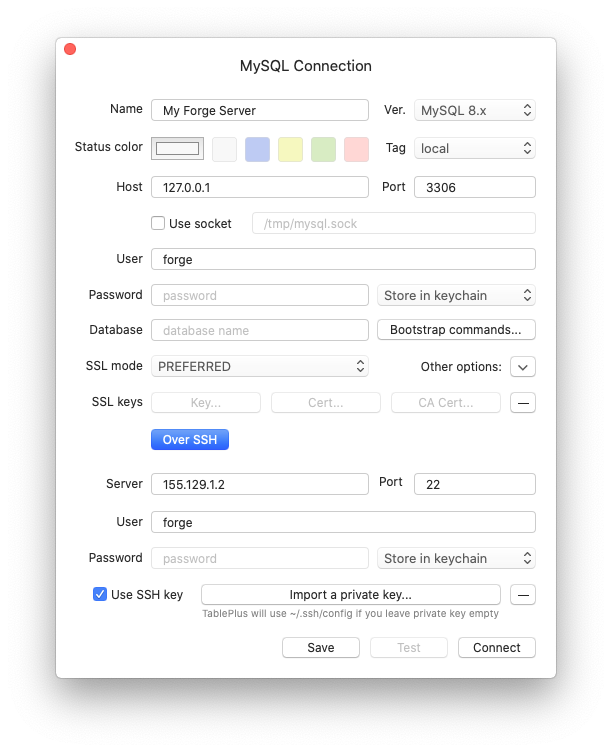

# Databases

[[toc]]

## Overview

When provisioning a new GoVPS server you may choose to install an [App Server](/1.0/servers/types.html#app-servers) or a [Database Server](/1.0/servers/types.html#database-servers). You can then use the GoVPS dashboard to manage databases, users, and permissions.

## Creating Servers With Databases

When creating a new server, you can select to install a supported database server:

- MySQL (8.0)
- MariaDB (10.6)
- PostgreSQL (12)
- PostgreSQL (13)
- PostgreSQL (14)

As part of the provisioning process, GoVPS will automatically install the selected database server and create a default `govps` database, `govps` user, and a secure, randomly-generated password. The database password will be shown upon creating the server alongside the root password. These passwords will also be emailed to you.

### Installing Databases Later

If you later decide to that you need to install a database on your server, you can do so through the server's **Databases** management tab. Once installed, you will then be able to manage your database via GoVPS.

:::danger Web Servers

If you created a "Web Server", you will not be able to install a database on that server at any point. Web servers are provisioned with the minimum amount of software needed to serve your PHP application only. If you need a database and web server on the same server, you should provision an "App Server".
:::

## Changing the Root / GoVPS Database Password

To reset the `root` and `govps` database user passwords, you may use the password reset functionality provided by GoVPS's **Databases** management tab.

:::danger Manually Changing The Root Password

You should not change the `root` or `govps` database user passwords manually or outside of the GoVPS dashboard. Doing so will prevent GoVPS from being able to connect to or manage your database.
:::

## Connecting To Databases Via A GUI Client

By default, database connections require SSH key authentication and are not able to be accessed using passwords. Therefore, when using a GUI database client to connect to your GoVPS database, you will need to use SSH authentication.

When selecting the SSH key to use during authentication, **ensure that you select your private SSH key**. For example, when using the [TablePlus](https://tableplus.com) database client:

### Using the Database Connection URL

Some clients, such as TablePlus, allow you to connect to a database via a connection URL. GoVPS automatically generates this connection URL for you and you can use it to connect to your database. Note that the password is not included in this URL, so you should provide your password manually within your database client's GUI.

## Managing Your Databases Within GoVPS

For servers running MySQL, MariaDB, and PostgreSQL, GoVPS offers some advanced features which allows it to manage your databases and database users easily. We'll discuss these features below.

### Creating Databases

You can create a new database through the server's **Database** tab within GoVPS. At a minimum, you must supply the name of your new database. The `govps` user will be able to access the database automatically.

### Syncing Databases

For consistency, you should use GoVPS to manage your databases and database users. However, if you created databases outside of the GoVPS dashboard, you can manually sync them into the GoVPS dashboard using the **Sync Databases** button on your GoVPS database management panel.

When syncing databases, some database names that are reserved by the database engine will not be synced, including:

- `mysql`
- `information_schema`
- `peformance_schema`
- `sys`
- `postgres`
- `template0`
- `template1`

### Creating Database Users

You can create extra database users through the GoVPS dashboard's database panel. To do so, you'll need to provide the username, password, and select the databases that the new user can access.

## Upgrading Databases

GoVPS does not provide the ability to upgrade your database server software automatically. If you wish to upgrade your database server, you will need to complete this manually.

## Circle Permissions

You may grant a circle member authority to create and manage databases **and** database users by granting the `server:create-databases` and `server:delete-databases` permissions.